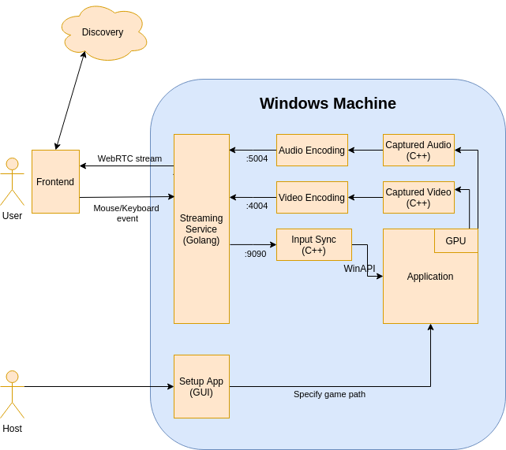

# cloud-morph-host

Windows client app for host on cloud-morph..

## Design

  
[Edit in draw.io](https://drive.google.com/file/d/1MuF32rcGpRHmpQrA0_MX2IgTkY6Evv7J/view?usp=sharing)

## Getting started

### 0. Setup

```
git clone --recurse-submodules https://github.com/DCloudGaming/cloud-morph-host.git
```

To update:

```
git pull --recurse-submodules
```

### 1. Start server

```
cd server
go run main.go
```

### 2. Run streamer

```
cd streamer
go run main.go
```

### 3. Run GUI, install Electron

```
cd gui
npm start
```

### 4. Run webapp

```
cd dcloud-webapp
npm install
npm start
```

### 5. Run full flow

- (First run) Setup Metamask extension
- (First run) Install sqlite3 from homebrew
- (First run) Initialize db
  - cd server
  - sqlite3 test.db
  - Copy paste commands from `cloud-morph-host/server/init_db/init_db.sql`
  - Check for errors
- Connect wallet
  - Click on Connect Wallet on React app
  - Connect and sign in Metamask pop-up
- Authorize Electron app
  - Get OTP on React app
  - Paste it to Electron app
  - Quick DB check
    - sqlite3
    - select \* from smart_otps;
    - We should see rows having both OTP and wallet addresses.
- (First run) Whitelist wallet address
  - sqlite3
  - INSERT INTO whitelisted_admins (id, wallet_address) VALUES (1, 'metamask-wallet-address');
- (First run) Register new app
  - Click Admin Update on React app navbar
  - Add some random app names
  - Save
- (First run) Register new app paths
  - Click Add app on Electron app
  - Pick a recently added app name
  - Choose the app
  - Save
- Start streaming
  - Go to http://localhost:3000/streams
  - Should see some cards
  - Click Start playing on one card
  - Should be directed to http://localhost:3000/play
  - Monitoring:
    - Console of React app: init/ice candidate/error logs
    - chrome://webrtc-internals/
- Notes
  - To restart the flow, sign out Metamask by
    - Click on Metamask extension icon
    - Click on Lock

### 6. Set up multi-machines locally to test

- (First time) Install [Ngrok](https://ngrok.com/download) and [localtunnel](https://theboroer.github.io/localtunnel-www/) to get a publicly accessible url that will proxy all requests to locally running webserver. Both of them do the same job, but Ngrok only provides one URL per free account.
- Run webservers
- Expose local ports
  - `./ngrok http 3000`
  - `lt --port 8080`
- Update env
  - Files
    - cloud-morph-host/gui/.env
    - cloud-morph-host/streamer/.env
    - dcloud-webapp/.env
  - Notes
    - `PORT` could not be empty for websocket host due to the parsing of `https://github.com/gorilla/websocket`. We can put use `3000` for localtunnel link ot bypass this.
    - `HOST` should be `http` for testing.

#### Run with sandbox

Setup Sandbox in Windows by

#### Sample env
**gui and streamer**
```
SIGNAL_HOST = localhost:8080
SIGNAL_PROTOCOL = http
HOST = localhost:8082
PORT = 8082
PROTOCOL = http

```
**server**
```
HOST = localhost:8080
PORT = 8080
PROTOCOL = http
DB = test.db
```
**dcloud-webapp**
```
HOST = localhost:8080
PROTOCOL = http
STREAMER_HOST = localhost:8082
STREAMER_PROTOCOL = http
```
#### Running in Sandbox (Recommended)
To setup Window Sandbox, Turn on Virtualization in Bios and Enable Windows Sandbox Feature. Tutorial https://techgenix.com/install-configure-and-use-windows-sandbox/
1. Using `setup-sandbox.ps1` to download and install necessary packages (FFMPEG) in sandbox image (`winvm/pkg`)
2. `go run server.go`


#### Temporary
Current order of actions must be like this (later we will make it more robust so no need to enforce this sequence)
1/ start server
2/ start streamer
3/ start gui
4/ start web, get OTP
5/ gui verifyOTP
6/ web start playing
